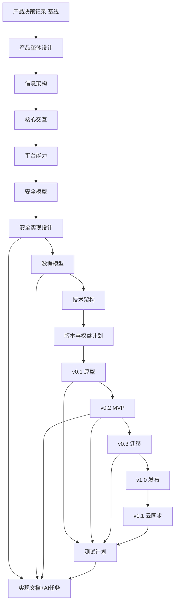

# 文档地图与串联

本文件是整个文档体系的导航与串联入口。它把已有文档按层组织，定义阅读顺序，给出从产品意图到实现任务再到测试的端到端可追溯链，并串联实现文档与 AI 任务拆分层。

## 1. 当前目标

文档要支撑后续由 AI 进行的实现（产品/设计/技术/版本/实现/架构各层已成体系，尚未写最终代码），因此需要：

- 架构文档：系统如何分层、各部分如何协作。
- 具体实现文档：每个小功能如何实现，包括接口、数据结构、步骤、边界与错误处理。
- AI 生成任务拆分：把每个功能拆成可由 AI 逐步生成的原子任务，并定义验收证据与依赖。

文档已覆盖产品、设计、技术、版本计划、实现（11/11，含 AI 任务拆分）与架构落地（模块架构 L1、工程基础 L0）各层；工程框架见第 7 节。

## 2. 文档分层与清单

### 2.1 产品与决策层

| 文档 | 作用 |
| --- | --- |
| [产品需求](product/product-requirements.md) | 产品要解决的问题与需求。 |
| [产品决策记录：主动选择式私密输入](product/product-decision-record.md) | 最高基线：主动选择是产品身份，平台能力是兼容增强。 |
| [产品整体设计](product/product-design.md) | 体验面与体验循环的整体设计。 |
| [信息架构设计](product/information-architecture.md) | 对象模型、顶层区域、键盘结构。 |
| [核心交互设计](product/interaction-design.md) | 核心交互路径、确认、错误与兜底。 |
| [平台能力设计](product/platform-capability-design.md) | 各平台能力矩阵与首平台选择。 |

### 2.2 版本执行计划层

| 文档 | 作用 | 任务前缀 |
| --- | --- | --- |
| [版本与权益计划](product/version-plan.md) | 发布阶段与商业版本、登录策略。 | — |
| [路线图](product/roadmap.md) | 阶段性目标。 | — |
| [v0.1 原型计划](product/v0.1-prototype-plan.md) | Android 首平台可行性原型。 | PROTO-xxx |
| [v0.2 离线 MVP 计划](product/v0.2-mvp-plan.md) | 第一个可用的离线产品。 | MVP-xxx |
| [v0.3 跨设备迁移计划](product/v0.3-migration-plan.md) | 用户自主控制的设备到设备迁移。 | MIG-xxx |
| [v1.0 公开发布计划](product/v1.0-release-plan.md) | 生产质量与发布质量门禁。 | REL-xxx |
| [v1.1 云同步计划](product/v1.1-cloud-sync-plan.md) | 可选端到端加密云同步。 | SYNC-xxx |

### 2.3 技术层

| 文档 | 作用 |
| --- | --- |
| [技术架构](technical/architecture.md) | 平台壳与共享核心、组件与数据流。 |
| [安全模型](technical/security-model.md) | 安全目标、信任边界、数据分级（方向性）。 |
| [安全实现设计](technical/security-implementation-design.md) | KDF、AEAD、密钥层级、文件格式、解锁会话（可实现规格）。 |
| [数据模型](technical/data-model.md) | 保险库、条目、字段、迁移包、同步对象的逻辑模型。 |
| [模块架构与层间契约](technical/module-architecture.md) | L1：Rust 共享核心 + 各端原生 UI 的模块结构、核心 API 与平台端口、依赖规则。 |
| [工程基础](technical/engineering-foundation.md) | L0：构建系统（Gradle+Cargo+UniFFI）、SDK/工具链基线、工程规范、CI 雏形。 |

### 2.4 测试层

| 文档 | 作用 |
| --- | --- |
| [测试策略](testing/test-strategy.md) | 测试方针与缺陷阻断原则。 |
| [测试计划](testing/test-plan.md) | 各版本可执行测试（TP-xxx）。 |

## 3. 治理与基线

[产品决策记录](product/product-decision-record.md) 是最高基线，所有文档必须服从：

- 主动选择是核心心智模型，是安全边界。
- 离线优先：核心本地使用不依赖账号或网络。
- 平台凭据与自动填充是标准登录场景的兼容增强，不是产品主路径。
- 生物识别是便利机制，不替代主密码这一根秘密。
- 云同步是可选增强，登录只用于云服务，本地使用永不依赖云。

任何下层文档（设计、技术、版本计划、实现、任务）都不得与该基线冲突。

## 4. 阅读顺序

- 新成员入门：产品需求 → 产品决策记录 → 产品整体设计 → 信息架构 → 核心交互 → 平台能力。
- 实现工程：安全模型 → 安全实现设计 → 数据模型 → 技术架构 → 模块架构 → 工程基础 → 对应版本计划 → 测试计划。
- 发布与质量：版本与权益计划 → v1.0 公开发布计划 → 测试计划。

## 5. 端到端可追溯表

下表把每个能力从产品与设计，串到技术决策，再串到版本计划任务和测试。任务前缀对应第 2.2 节。

| 能力 | 产品与设计 | 技术 | 版本计划任务 | 测试 |
| --- | --- | --- | --- | --- |
| 本地加密保险库 | 产品整体设计、信息架构 | 安全模型、安全实现设计 §2-4、数据模型 | MVP-001、REL-001 | TP-101、TP-107 |
| 主密码与解锁 | 核心交互 §4、安全模型 §5 | 安全实现设计 §5 | MVP-002 | TP-107 |
| 生物识别解锁 | 核心交互 §2.4、平台能力 | 安全实现设计 §5、§6 | MVP-003 | TP-107（间接） |
| 安全键盘主动输入 | 核心交互 §6、信息架构、平台能力 | 技术架构 §4 | PROTO-003/004/005、MVP-005、REL-001 | TP-001..005 |
| 条目与字段管理 | 信息架构、核心交互 §5 | 数据模型 §2-3 | MVP-004 | TP-103 |
| 密码生成器 | 版本与权益计划 | 安全实现设计 §2.3（CSPRNG） | MVP-006 | 单元测试 |
| 基础 TOTP | 数据模型 §4、v0.2 §3.1 | 安全实现设计（种子加密） | MVP-007 | TP-104 |
| 加密导出与导入 | 核心交互、版本计划 | 安全实现设计 §8 | MVP-008 | TP-105/106/108 |
| 剪贴板兜底 | 核心交互 §3.3 | 安全实现设计 §7 | MVP-009 | TP-109 |
| 跨设备迁移 | v0.3 迁移计划 | 安全实现设计 §8、数据模型 TransferPackage | MIG-001..008 | TP-301..308 |
| 平台凭据与自动填充（兼容增强） | 平台能力、核心交互 §3.1、决策记录 | 技术架构 | 兼容增强，非主路径 | — |
| 云同步（可选） | v1.1 云同步计划、技术架构 §6 | 安全实现设计 §8、数据模型 SyncObject | SYNC-001..008 | TP-201..206 |
| 发布安全质量门禁 | v1.0 发布计划 §4 | OWASP MASVS 对齐 | REL-005 | 发布回归（聚合） |
| 离线与隐私保障 | 决策记录、核心交互 §3.4 | 安全实现设计 §7 | PROTO-006、MVP-010、SYNC-008 | TP-003/005、TP-102、TP-202 |

## 6. 文档关系图

## 7. 后续文档层

实现文档层已完成（11/11）。统一结构、技术栈策略和 AI 任务拆分规范见 [实现文档层总览](implementation/README.md)。

- 实现文档：位于 `docs/implementation/`，每个功能一份，按 v0.1 至 v1.1 顺序展开，先 Android。
- AI 任务拆分：作为每份实现文档的一节（任务 ID、输入、产出物、约束、验收证据、依赖），不单独建目录。
- 技术栈：一套 Rust 共享核心（现在就建）+ 各端原生 UI；先实现 Android（Kotlin）；iOS 与 HarmonyOS 适配放到 v1 末尾。见 [模块架构与层间契约](technical/module-architecture.md)。
- 实现文档：已全部完成 11 份（状态见 [实现文档层总览](implementation/README.md) 第 5 节）。

## 8. 文档约定

- 文档使用中文编写，保留必要的英文技术术语。
- 每份文档显式声明服从产品决策记录基线，并包含防漂移措辞。
- 平台能力未经验证的部分标注为待验证，不夸大。
- 新增文档后更新本文件与顶层 README 的索引。
- 未经评审的产品与实现点子记录在 [灵感库](inspiration.md)，不是已决定的需求。
